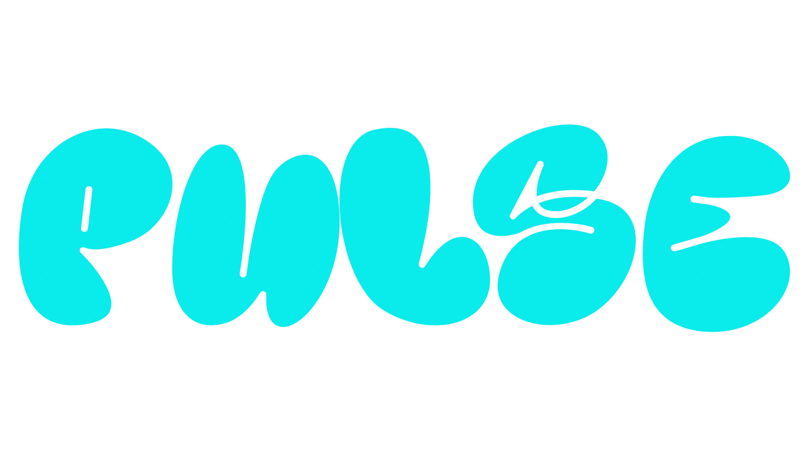

<p align="center">
  
<p/>

<h3 align="center">Pulse</h2>
<p align="center">
  An open source, multi purpose organization
</p>

## Our mission
<p>The main goal of Pulse is to give back to the community with this low-scale monorepo (bootstrapped with Turborepo) inspired by Google. We aim to priotize security first over the amount of products we offer to create the best experience for you.</h4>

### Built with

- [Next.js](https://nextjs.org)
- [Nest.js](https://nestjs.com)
- [React](https://react.dev)
- [Tailwind CSS](https://tailwindcss.com)

## Getting started

To get a local copy up and running, please follow these simple steps.

### Prerequisites

- Node.js (Version >=18)
- NPM (recommended)
- MongoDB

## Setup

Now that you have met the requirements of the project, we can continue with installation.

1. First run
```
git clone https://github.com/PulseMusik/pulse-music.git
```

   > If you are on Windows, run the following command on `gitbash` with admin privileges: <br> > `git clone -c core.symlinks=true https://github.com/calcom/cal.com.git` <br>

2. From the root of the project, run
```
npm install
```

## Acknowledgements

Thanks again to these amazing projects which help power Pulse:

- [Next.js](https://nextjs.org/)
- [Day.js](https://nestjs.com/)
- [Tailwind CSS](https://tailwindcss.com/)
- [MongoDB](https://mongodb.com/)
